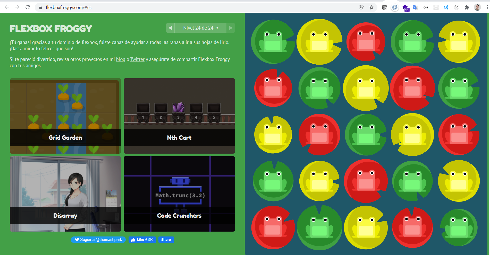

# FlexboxFroggy

<table>
  <tr>
      <td>
      <a href="https://jorge-vicuna.gitlab.io/jorge-vicuna/">
        
        <br />
        <sub><b>Jorge Vicuña Valle</b></sub>
      </a>
    </td>
</Table>

## Vista:



# Respuestas

```
1.  justify-content: flex-end;
2.  justify-content: center;
3.  justify-content: space-around;
4.  justify-content: space-between;
5.  align-items: flex-end;
6.  justify-content: center;
    align-items: center;
7.  justify-content: space-around;
    align-items: flex-end;
8.  flex-direction: row-reverse;
9.  flex-direction: column;
10. flex-direction: row-reverse;
    justify-content: flex-end;
11. flex-direction: column;
    justify-content: flex-end;
12. flex-direction: column-reverse;
    justify-content: space-between;
13. flex-direction: row-reverse;
    justify-content: center;
    align-items: flex-end;
14. order: 1;
15. order: -1;
16. align-self: flex-end;
17. order: 1;
    align-self: flex-end;
18. flex-wrap: wrap;
19. flex-direction: column;
    flex-wrap: wrap;
20. flex-flow: column wrap;
21. align-content: flex-start;
22. align-content: flex-end;
23. flex-direction: column-reverse;
    align-content: center;
24. flex-flow:column-reverse wrap-reverse;
    justify-content:center;
    align-content:space-between;
```
